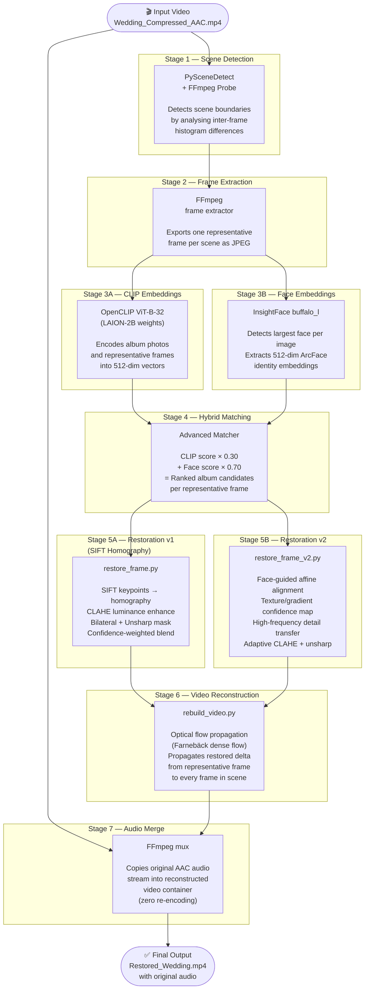

> See also: [Interactive preview site](preview.md)

# Pipeline Architecture

This document describes the full 9-stage AI Video Restoration pipeline using a
Mermaid diagram, followed by data-flow notes for each connection.

---

## High-Level Pipeline Diagram

---

## Data Flow Summary

| Connection | Data Transferred |
|---|---|
| Video → Scene Detection | Raw video stream (pixel data) |
| Scene Detection → Frame Extraction | Scene CSV (start frame, end frame, length) |
| Frame Extraction → CLIP | Representative frame JPEGs |
| Frame Extraction → Face | Representative frame JPEGs |
| Album Photos → CLIP | Album photo JPEGs |
| Album Photos → Face | Album photo JPEGs |
| CLIP + Face → Matcher | `.npy` embedding matrices + name lists |
| Matcher → Restore | `advanced_matches.csv` (Frame, AlbumImage, Rank, Scores) |
| Restore → Rebuild | Restored representative frame JPEGs |
| Rebuild → Audio Merge | Silent reconstructed `.mp4` |
| Video → Audio Merge | Original AAC audio stream |

---

## Key Design Decisions

### Why scene-based processing?
Processing every frame individually against every album photo would be
computationally intractable (~30 fps × hours of video × hundreds of album
photos = billions of comparisons). Scene detection reduces this to one
representative frame per scene (~50–200 scenes per hour of video).

### Why 70% face / 30% CLIP weighting?
Wedding videos are identity-centric. A frame containing the couple's faces
must match an album photo of the same faces even if the background, lighting,
or clothing color shifts the CLIP score. Face embeddings provide pose- and
lighting-invariant identity matching that CLIP alone cannot guarantee.

### Why optical flow propagation?
Directly applying the restoration to only representative frames would produce
visible temporal discontinuities (flicker) at scene transitions. The
Farnebäck dense optical flow warps the enhancement delta from the reference
frame to all neighboring frames in the scene, preserving temporal coherence.

### Why two restoration versions?
- **v1** (SIFT homography): Robust when faces are small or absent; uses global
  geometric alignment between album and frame.
- **v2** (Face affine): More accurate when both images contain large, matching
  faces; uses face-landmark-guided affine transform for sub-pixel alignment.

